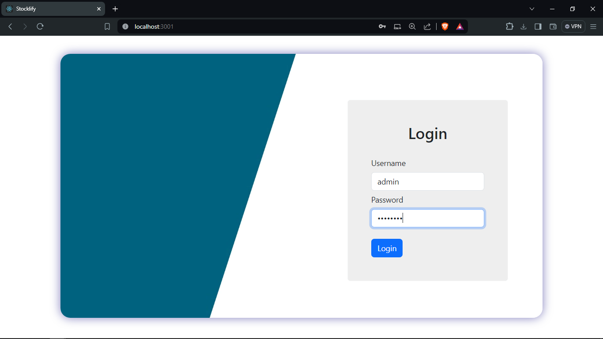
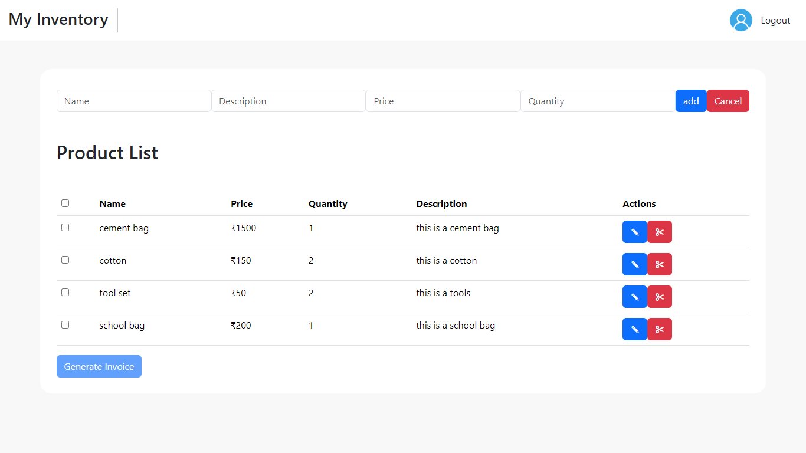
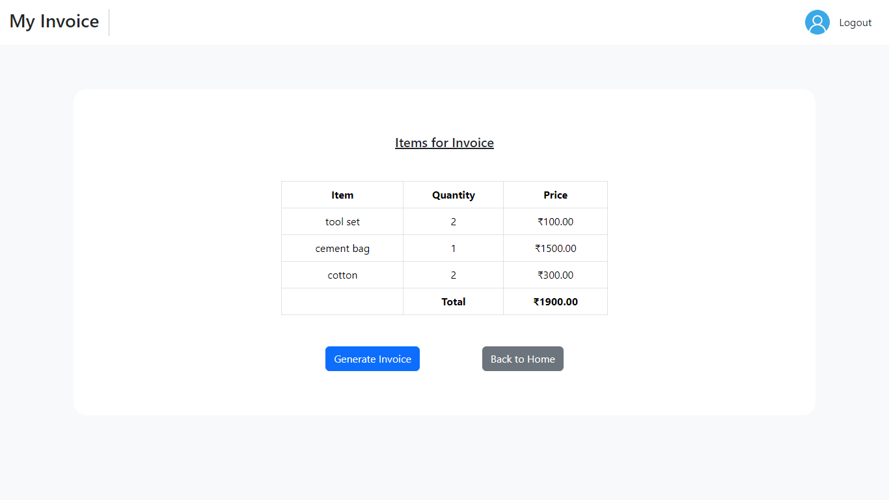
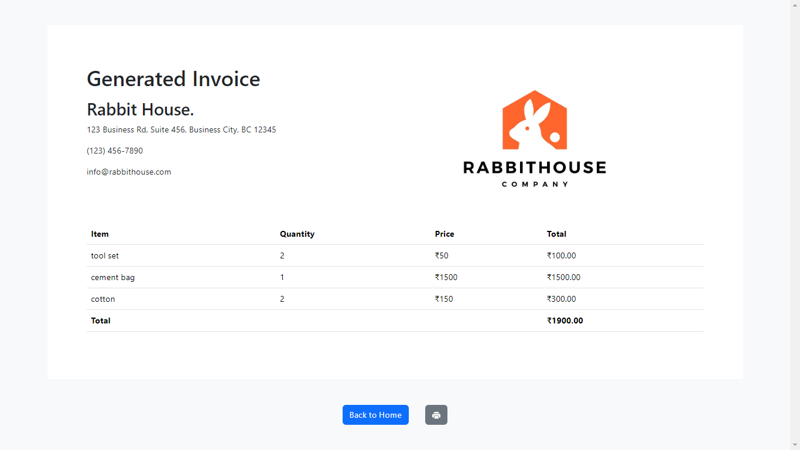

# Stocklify

Stocklify is a full-stack application for inventory management. It consists of a backend built with NestJS and a frontend built with React.

## Getting Started

These instructions will get you a copy of the project up and running on your local machine for development and testing purposes.

### Prerequisites

- Node.js
- npm

### Installing

1. Clone the repository
2. Navigate to the backend directory and install dependencies with `npm install`
3. Start the backend server with `npm run start:dev`
4. Navigate to the frontend directory and install dependencies with `npm install`
5. Start the frontend server with `npm start`

## Running the tests

For backend tests, navigate to the backend directory and run `npm run test` to execute the unit tests.

## Built With

- [NestJS](https://nestjs.com/) - A progressive Node.js framework for building efficient, reliable and scalable server-side applications.
- [React](https://reactjs.org/) - A JavaScript library for building user interfaces.

## API Documentation

API documentation for the backend is available at `/api` endpoint when the server is running.

## Frontend

The frontend of the application is built with React and can be accessed at `localhost:3001` when the server is running.

## Output Images
 

 

 
{:width="400px"}
 
{:width="400px"}
 
